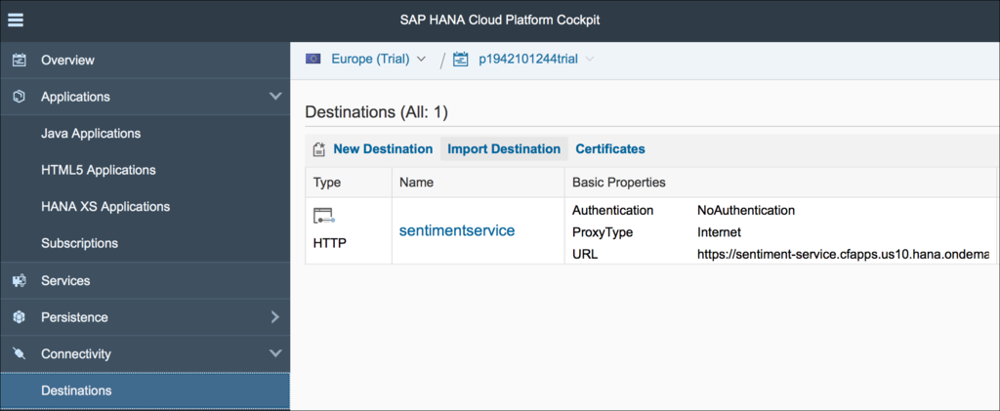
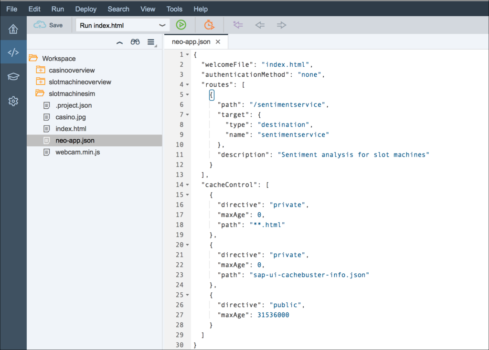
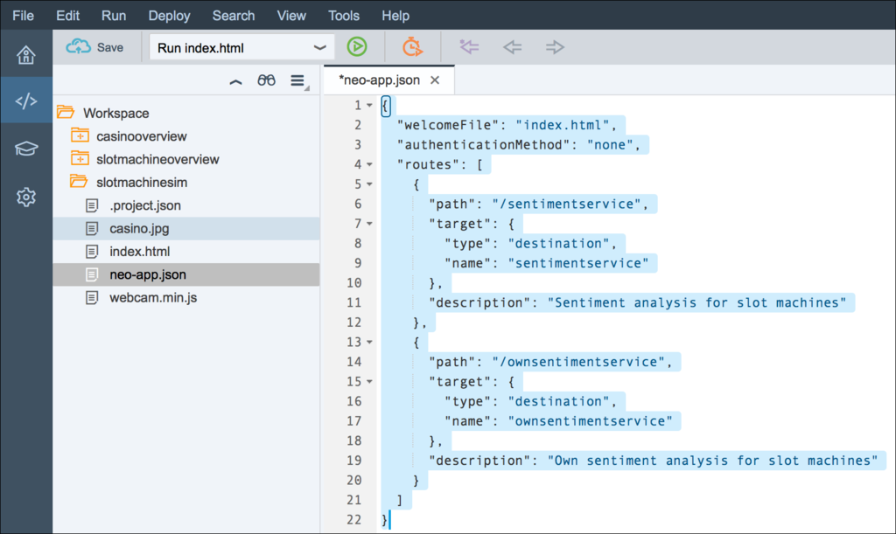
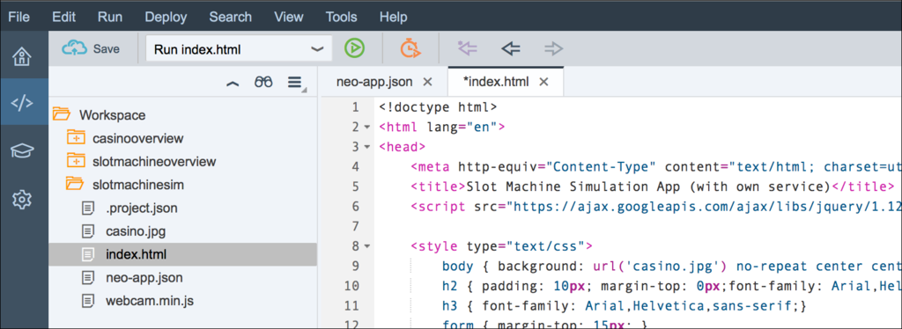
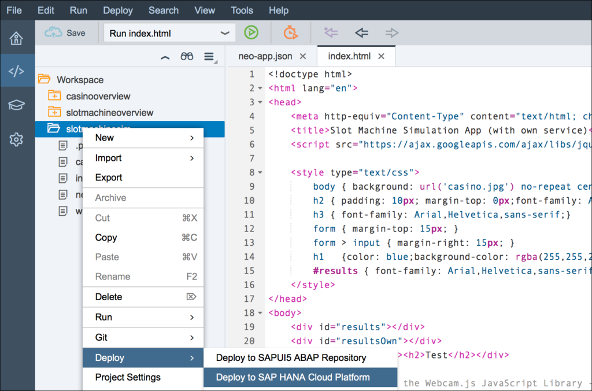

# Exercise 09: Change Slot Machine Simulation App to Use “Own” Casino Sentiment Service  

**Estimated time**

10 min

**Objective**

In this exercise you will change the Slot Machine Simulation app to call your own Casino Sentiment Service.

**Exercise description**

Change code of the Slot Machine Simulation app to send requests both to central Casino Sentiment Service and to your own service running in your Cloud Foundry account. You will also add a second destination which points to your own Casino Sentiment Service.

## 1. Add additional destination to your own sentiment service instance

1. Open your free developer account in the browser via the link [https://account.hanatrial.ondemand.com/cockpit](https://account.hanatrial.ondemand.com/cockpit) so that you get to the HCP cockpit - the landing page for your HCP account.
<br><br>

<br><br>
2. Click on the tab ```Destinations``` on the left hand side navigation pane.
<br><br>

<br><br>
3. Click on the link ```Import Destination```, select the file ```./cloud-cf-casino/html5apps/destination_sentimentservice.txt``` from your **student directory folder**. Change the field ```Name``` to ```ownsentimentservice```, as well as the field ```Description``` to the same value. Finally change the field ```URL``` to the URL of your own sentiment service you have deployed in the previous exercises. Now click on ```Save```.    
<br><br>

<br><br>

## 2. Change the code in the Slot Machine Simulator App
### 2.1 Change neo-app.json
1. Open again the SAP Web IDE (this can be done in the HCP cockpit: ```Services``` > ```SAP Web IDE``` > ```Open SAP Web IDE```). Expand the folder ```slotmachinesim``` and double-click on the file ```neo-app.json``` so that the file opens up in the editor.   
<br>

<br><br>
2. Substitute the current content of the file with the following code
```   
{
  "welcomeFile": "index.html",
  "authenticationMethod": "none",
  "routes": [
    {
      "path": "/sentimentservice",
      "target": {
        "type": "destination",
        "name": "sentimentservice"
      },
      "description": "Sentiment analysis for slot machines"
    },
    {
      "path": "/ownsentimentservice",
      "target": {
        "type": "destination",
        "name": "ownsentimentservice"
      },
      "description": "Own sentiment analysis for slot machines"
    }
  ]
}
```
After that click on the ```Save```button (top left icon with the cloud symbol).
<br><br>

<br><br>

### 2.2 Change index.html
1. Double-click on the file ```index.html``` so that the file opens up in the editor.   
<br>

<br><br>
2. Substitute the current content of the file with the code of the file ```./cloud-cf-casino/html5apps/exercise09_index.html``` that you find in the **student directory folder**. After that click on the ```Save```button.
<br><br>

<br>

### 2.3 Deploy and test the app
1. To deploy the app to your account you need to right-click on the ```slotmachinesim``` folder and select the commands ```Deploy``` > ```Deploy to SAP HANA Cloud Platform```   
<br>

<br>

2. You have now changed the Slot Machine Simulation Application to use your own Casino Sentiment Service that runs in your Cloud Foundry account. You can continue now to send images to the service through this application.
**Summary**

Congratulations! You have successfully completed the tutorial.
<br><br>
In this tutorial, you have learned
* how to get access to the HCP Cloud Foundry beta version
* how to develop a microservice using the Spring framework: Spring MVC, Spring Boot and Spring Cloud
* how to consume remote services which are accessible through SAP Hybris as a Service (YaaS)
* how to make a distributed service more resilient using Netflix Hystrix
* how to call a service running on Cloud Foundry from an HTML5 application by using Destinations  

[back to home](../../../../)
